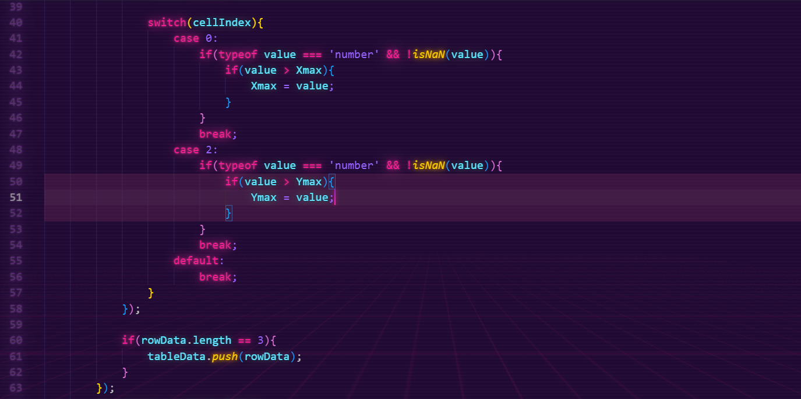

## Features
Highlights the current scope relative to the cursor. 
The highlighting can be configured to custom RGBA (RGB color and opacity).
You can set custom delimiters of variable length, such as "begin" and "end".
You can choose to have entire lines or character-specific scopes highlighted (example below).

Example 1 (entireLine enabled):

Example 2 (entireLine disabled):

Business Central AL example:


*Note: the extension is currently not designed to handle indentation-based scope.*

## Extension Settings
This extension contributes the following user settings:

* `scope-highlighter.startdelimiter`: the string to delimit start of scope. Default is "{".
* `scope-highlighter.enddelimiter`: The string to delimit the end of scope. Default is "}".
* `scope-highlighter.multiLineCommentStart`: The string to delimit the beginning of a multi-line comment. Default is "/*".
* `scope-highlighter.multiLineCommentEnd`: The string to delimit the end of a multi-line comment. Default is "*/".
* `scope-highlighter.singleLineComment`: The string to create a comment. Default is "//".
* `scope-highlighter.red`: The red value for the highlighting RGB (0-255). Default is 100.
* `scope-highlighter.green`: The green value for the highlighting RGB (0-255). Default is 40.
* `scope-highlighter.blue`: The blue value for the highlighting RGB (0-255). Default is 80.
* `scope-highlighter.alpha`: The alpha (opacity) value for the highlighting RGB (0.0-1.0). Default is 0.4. A higher value means more visible highlighting.
* `scope-highlighter.entireLine`: whether to highlight entire lines included in the scope or only the characters in scope. Default is true (entire lines will be highlighted).

## Known Issues
- Extension must sometimes be reloaded after making configuration changes.
- delimiter instances in single line comments that contain code on the same line are not counted correctly.
- commented or literal instances of multiline comment start/end characters are counted when they should be ignored. 

\* Delimiters found outside of comments and strings/literals are not ignored. It is recommended to not include your delimiters in names or identifiers (or outside of string literals). 

## Release Notes
### v 0.0.3 (August, 2024)
* Added the ```entireLine``` setting to allow further customization. Added a sample image below.

### v 0.0.2 (May 28, 2024)
* README page updated with usage examples
### v 0.0.1 (May 26, 2024)
* The extension is incomplete, but works in some situations (issue cases described below).
  * Delimiters scanning can become erroneous when additional multiline comment start/end characters are nested inside a multiline comment.   


# Developer TODO List
- fix single line comment issue
- fix [not] ignoring delimiters inside string literals
- investigate auto reload extension settings
- more testing
- finish the README file